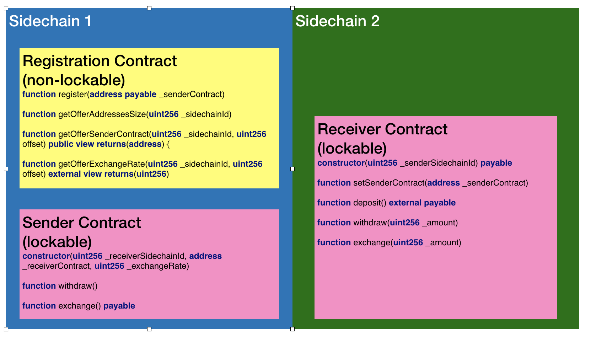

# Atomic Swap Ether sample code

Note that the terms _sidechain_ and _blockchain_ are used in this sample. For the purposes
of this sample, they should be considered the same thing. 

## Introduction
This sample demonstrates:
 * Swapping Ether on one blockchain for Ether on another blockchain.
 * Allowing for partial swapping of Ether. That is, allowing one entity to offer an 
 amount of Ether on one blockchain, say 5 Ether with an exchange rate between chains of 
 1.0, and allow another entity to accept the offer but only swap a partial amount, 
 say 2 Ether. 
 * Using a non-lockable registration contract with lockable contracts. Having a non-lockable
 registration contract means that the contract can not be locked. However, this means the 
 contract can not become part of a crosschain transaction. The registration contract can
 be used to locate lockable contracts which can be part of a crosschain transaction: in 
 this case to allow swapping of Ether between blockchains.

## Running the Sample Code

This sample is to be used with two crosschain-enabled Hyperledger Besu instances
each operating as a node on three separate sidechains. See the _crosschain_ directory in the
[sidechains-besu github respository](https://github.com/PegaSysEng/sidechains-besu/tree/master/crosschain)
 for details of how to build and deploy the Hyperledger Besu instances. 

The instances need to operate as follows:
* Sidechain 1: Sidechain ID: 11. Address http://127.0.0.1:8110/ 
* Sidechain 2: Sidechain ID: 22. Address http://127.0.0.1:8220/ 

## Details

This sample uses four entities and three contracts. The entities are:
* A faucet. This entity supplies Ether for the purposes of this sample code.
* Registration Owner: An entity that has deployed a registration contract for the purpose
of allowing other entities wishing to swap Ether to find each other.
* Entity Offering Ether: An entity that has Ether available on Sidechain 2 that 
would like Ether on Sidechain 1. 
* Entity Accepting Offer: An entity that has Ether available on Sidechain 1 that 
would like Ether on Sidechain 2. 

The contracts are shown in the diagram below:

The contracts are:
* Receiver Contract: A lockable contract deployed on Sidechain 2 by the Entity Offering Ether. 
The entity funds the contract when deploying it and can later add funds to the contract.
* Sender Contract: A lockable contract deployed on Sidechain 1 by the Entity Offering Ether.
The entity can withdraw funds from the contract once an exchange has occurred.
* Registration Contract: A non-lockable contract deployed on Sidechain 1 by the Registration Owner.

At a high level, the sequence of events are:
* Entity Offering Ether deploys Receiver Contract, funding it with some Ether. 
* Entity Offering Ether deploys Sender Contract linking it to the Receiver Contract and specifying an 
exchange rate between blockchains.
* Entity Offering Ether links the Receiver Contract to the Sender Contract by calling `setSenderContract`.
* Entity Offering Ether registers the Sender Contract with the Registration Contract by calling `register`.
* Entity Accepting Offer uses the Registration Contract to locate an appropriate Sender 
Contract for the sidechain they wish to obtain Ether for, at an exchange rate they find acceptable.
* Entity Accepting Offer calls the Sender Contracts `exchange` function with a Crosschain Transaction.
The transaction includes a Subordinate Transaction which calls the Receiver Contract's `exchange` 
function.
* Entity Offering Ether withdraws Ether from the Sender Contract. 

# Code design features

## Exchange Rate
The exchange rate is a number indicating the relative worth of Ether on one sidechain compared
to another sidechain. The exchange rate is a decimal number which can range from 263-1 to 2-64 
(9.223372036854776e18 to 5.421010862427522e-20). It is passed into the Solidity code assuming
the decimal point is 264.

## Registration Process
The `registration` function takes the address of the Sender Contract as as parameter. It 
then calls the Sender Contract to determine which sidechain Ether is to be swapped and at 
what exchange rate the Sender Contract will use.

## Crosschain Call Authentication
The Receiver Contract's `exchange` function checks that the function is being called from
the expected Sender contract. This authentication information is fetched out of the Subordinate
Transaction. The crosschain transaction will not be committed if the Subordinate Transaction
information is invalid.

# Modifying the Sampe Code
## Solidity Code
To update the Solidity code:
* Change the contracts in ./contracts
* Have sidechains-web3j (https://github.com/drinkcoffee/sidechains-web3j) at the same directory 
level as this repo. 
* Build the sidechains-web3j using `./gradlew installDist`
* Extract the crosschain code generator executable using `cd sidechains-web3j/besucodegen/build/distributions`. 
Then extract the tar file containing the executable `tar xvf NAME_OF_TAR.tar`
* From this directory, regenerate the Solidity wrapper code using `sh generatewrappers.sh` 
* Copy the generated Java files from `build/tech/pegasys/samples/crosschain/atomicswapether/soliditywrappers`
to `src/main/java/tech/pegasys/samples/crosschain/atomicswapether/soliditywrappers` using
`sh copygeneratedwrappers.sh`.
* Rebuild the sample code.
